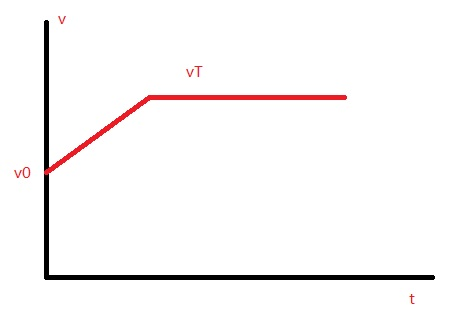
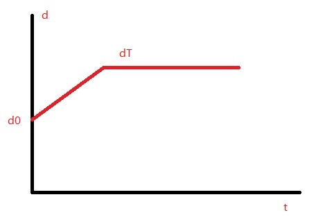
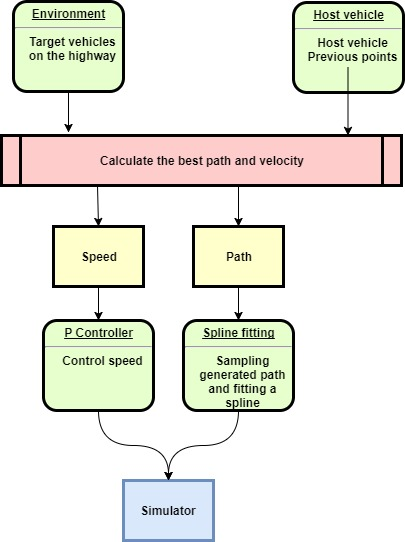

# Path Planning

## Introduction

This project addresses the problem of path trajectory generation for the highway scenario. To drive the car smoothly and safely, it must not collide with any other cars, follow the speed limit, and has moderate jerk.

To solve this problem, I process the longitudinal coordinate **s** and latitudinal coordinate **d** seperately. For **s**, I assume the vehicle drives at a constant acceleration. The speed profile is shown in the following figure



Given the initial state [`s0`, `vs0`, 0], duration `T`, and accleration `as`, choose a destination speed `vsT` and **s**(t) can be calculated. `vsT` is inperpolated on [0, `Vm`], where `Vm` is the speed limit. If `Nv` samples of `vsT` are interpolated, only `Nv` iterations are computed to solve **s**.

For **d**, I assume the host vehicel drives at a constant speed 2m/s. So it normally takes 2s for the vehicle to change to a adjacent lane. The displacement profile of **d** is shown as below:



where `d0` is the initial position of **d**, and `dT` is the position of the target lane. `dT = 4*i+2, i = 0,1,2`

The obtained path (**s**, **d**) is **not smooth** at a few corner points. However, we could take a few sample points from the path and fit them with a spline. 

Combining **s** and **d**, 3*`Nv` trajectories can be obtianed. To choose the best trajectory, a few cost functions are used to evaluate those trajectories, including collision cost, efficiency cost, lane change cost, speed limit cost, low speed cost, buffer distance cost, etc.


**Note**: this report is talking about branch *submitted*. Make sure you are looking at the correct branch.

## Overview of the system

The system overview of the project is showed in the following diagram. 



The host vehicle calculates a goal speed and a path based on its own state and the states of other vehicles on the highway. A P controller is used to control velocity of the host vehicle. For the trajectory, first take a few sample points from the path at some time steps (line `339-343` of `main.cpp`):

```
vector<double> t_fit = {1, 2, 3, 4, 5};
vector<double> fit_s, fit_d;
ego_rst.pos(t_fit, fit_s, fit_d);
```

Steps of the system in time order:

1. Transfer those points from Frenet CS to Cartesian CS (line `356-361`)
2. Transfer world CS to the vehicle CS (line `398`)
3. Fit those points with a spline (line `405`)
4. Control speed using a P controller (line `412-423`)
5. Get the trajectory points (line `4225-429`)
6. Convert them from Vehicle CS to world CS (line `430`)
7. Send them to the simulator

## Choose the best path

The function `choose_next_state_v3` (line `15-126` of `helpers.cpp`) is used to select the best path. It generates all trajectories and calculates the cost of each trajectory. Based on the costs, the trajectory with minimal cost is choosen.


## Trajectory

A class `Traj2D` (line `34-238` of `helpers.h`) is created to generate a trajectory. The constructor

```
Traj2D(const double s_0, const double d_0, const double v_0, const double v_s, const int lane)
```

calculates a trajectory given the initial longitudinal displacemnt `s_0`, initial latitudinal displacement `d_0`, initial longitudinal speed `v_0`, longitudinal goal speed `v_s`, and goal lane `lane` (0,1,2). The trajectory is stored in two vectors of doubles: `s` and `d`, which are of member data of `Traj2D`.

The trajectory is easily calculated based on the first two figures of this report. For the interested reader, see line `66-123` of 'helpers.h'.


### Cost Functions

`calculate_cost_traj` is used to calculate the cost of a trajectory, defined in line `29-119` of `cost_functions.cpp`:

```
double calculate_cost_traj(const vector<double> &traj,
                           const int &target_vehicle,
                           const vector<double> &delta, const double T,
                           const vector<Vehicle> &predictions, int lane,
                           bool verbose)
{
    double cost = 0;
    vector<double> s(traj.begin(), traj.begin() + 6);
    auto s_dot = differntiate(s);
    auto s_ddot = differntiate(s_dot);
    auto s_tdot = differntiate(s_ddot);

    vector<double> d(traj.begin() + 6, traj.begin() + 12);
    auto d_dot = differntiate(d);
    auto d_ddot = differntiate(d_dot);
    auto d_tdot = differntiate(d_ddot);

    vector<double> t;
    for (int i = 0; i < 101; ++i)
    {
        t.push_back(float(i) / 100. * T);
    }

    auto s_s = polyval(s, t);
    auto s_v = polyval(s_dot, t);
    auto s_a = polyval(s_ddot, t);
    auto s_j = polyval(s_tdot, t);

    auto d_s = polyval(d, t);
    auto d_v = polyval(d_dot, t);
    auto d_a = polyval(d_ddot, t);
    auto d_j = polyval(d_tdot, t);

    // cost of going straight at the center line of the current lane
    double md = meanVecAbs(d_s) - 4.0 * lane - 2.0;
    double cost_straight = logistic(md) * 1.0;
    cost += cost_straight;

    // cost of distance to the goal
    double dist_to_goal = MAX_SPEED * T - (s_s[s_s.size() - 1] - s_s[0]);
    double cost_to_goal = logistic(2 * dist_to_goal / (MAX_SPEED * T)) * 20.0;
    cost += cost_to_goal;

    // cost of speed limit
    double mv = maxVelocity(s_v, d_v);
    double cost_speed_limit = 0;
    if (mv > MAX_SPEED)
        cost_speed_limit = 1.0 * 0;
    cost += cost_speed_limit;

    // cost of acc limit
    double ma = maxVelocity(s_a, d_a);
    double cost_acc_limit = 0;
    if (ma > MAX_ACC)
        cost_acc_limit = 1.0 * 50;
    cost += cost_acc_limit;

    // cost of jerk limit
    double mj = maxVelocity(s_j, d_j);
    double cost_jerk_limit = 0;
    if (mj > MAX_JERK)
        cost_jerk_limit = 1.0 * 50;
    cost += cost_jerk_limit;

    // cost of collision
    double cost_collision =
        collision_cost(traj, target_vehicle, delta, T, predictions) * 50;
    cost += cost_collision;

    // cost of buffer distance
    double buffer_dist_cost = buffer_cost(traj, target_vehicle, delta, T, predictions) * 20;
    cost += buffer_dist_cost;

    // cost of end speed
    double cost_end_speed = logistic(2.0 * abs(MAX_SPEED - s_v[100]) / MAX_SPEED) * 10;
    cost += cost_end_speed;

    if (verbose)
    {
        cout << "cost_straight = " << cost_straight << endl;
        cout << "cost_to_goal = " << cost_to_goal << endl;
        cout << "cost_speed_limit = " << cost_speed_limit << endl;
        cout << "cost_acc_limit = " << cost_acc_limit << endl;
        cout << "cost_jerk_limit = " << cost_jerk_limit << endl;
        cout << "cost_collision = " << cost_collision << endl;
        cout << "buffer_dist_cost = " << buffer_dist_cost << endl;
        cout << "cost_end_speed = " << cost_end_speed << endl;
        cout << "Total = " << cost << endl;
    }
    return cost;
}
```


## Reflection

This project takes a lot longer than I expected. I first tried to implement the python code of PTG playground of the course, see the dev branch. It has a few drawbacks:

1. It's difficult to follow a vehicle. It needs the goal state as input, which has 6 variables. Searching proper goal state is problem.
2. It's slow. It iterates through three variables: `s`, 'd', 'T'. It can easily get hundreads of iterations.
3. It's difficult to drive fast, or keep the speed limit. The reason is the same as item 1.
4. Due to the delay of the simulator and coordinate transformation of Frenet, it's not easy to send precise points at correct time to the simulator.

After reading the paper `Optimal Trajectory Generation for Dynamic Street Scenarios in a Frene´t Frame`, I found one should design different goal state for different driving scenarios. Then it needs a state machine to determine available states. This is quite some work and I'll have a try later.

As a workaround, I'm trying to simplify the problem from the perspective of a driver on the highway. The host vehicle should drive as fast as possible, which means the longitudinal velocity should be large. To overtake slow vehicles, just turn to left or right at right time, i.e., choosing correct lane. Therefore, I decomposite the trajectory in s and d direction seperately. For continuity of the trajectory, a spline can be used to smooth the trajectory. For speed limit and jerk, a P controller (probably PID controller is a beeter choice) is applied to make sure the vehicle does not drive wildly.

